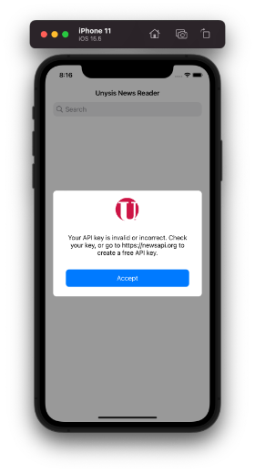
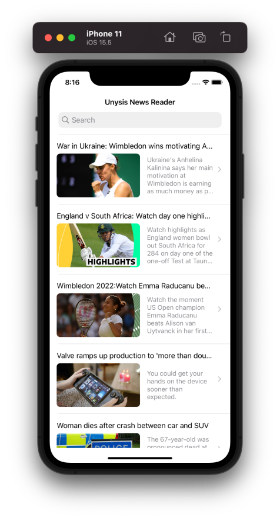
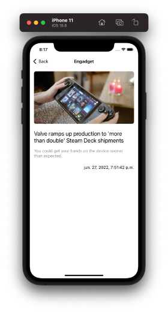
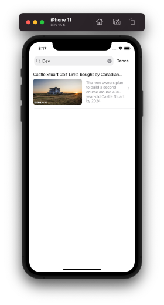
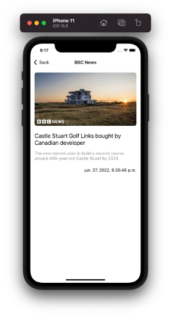

# News
Technical test for Unisys company

# Documentation:
- I have selected MVVM + Coordinator pattern because it's easier to test all the logic related to the business App. Also, you have a total control of all classes in order to preserve that each class has just one thing to do.
- Calling to the API has been made without any third library. In my opinion it is not necessary nowadays at all.
- Data Persistant has been made throught Core Data.
- Using Coordinators as a pattern for views transictions make really EASY our live and clean our code a lot. This MVVM + Coordinator is like a pseudo VIPER but with less boilerplate code.
- Just for lack of time, I did NOT add any other extra feature: Dark mode,  localized strings...

# How to test
- Clone the project
- Get an APIKey from [https://newsapi.org](https://newsapi.org/) and paste it in the Constants file.
- Run the project 🥳

Screenshots:

Error handle:

Fetch and show details:

Filter and show details:

Visit my blog for more info: [www.oscargarrucho.com](http://www.oscargarrucho.com/)

MIT License

Copyright (c) 2018 Chester How

Permission is hereby granted, free of charge, to any person obtaining a copy of this software and associated documentation files (the "Software"), to deal in the Software without restriction, including without limitation the rights to use, copy, modify, merge, publish, distribute, sublicense, and/or sell copies of the Software, and to permit persons to whom the Software is furnished to do so, subject to the following conditions:

The above copyright notice and this permission notice shall be included in all copies or substantial portions of the Software.

THE SOFTWARE IS PROVIDED "AS IS", WITHOUT WARRANTY OF ANY KIND, EXPRESS OR IMPLIED, INCLUDING BUT NOT LIMITED TO THE WARRANTIES OF MERCHANTABILITY, FITNESS FOR A PARTICULAR PURPOSE AND NONINFRINGEMENT. IN NO EVENT SHALL THE AUTHORS OR COPYRIGHT HOLDERS BE LIABLE FOR ANY CLAIM, DAMAGES OR OTHER LIABILITY, WHETHER IN AN ACTION OF CONTRACT, TORT OR OTHERWISE, ARISING FROM, OUT OF OR IN CONNECTION WITH THE SOFTWARE OR THE USE OR OTHER DEALINGS IN THE SOFTWARE.
